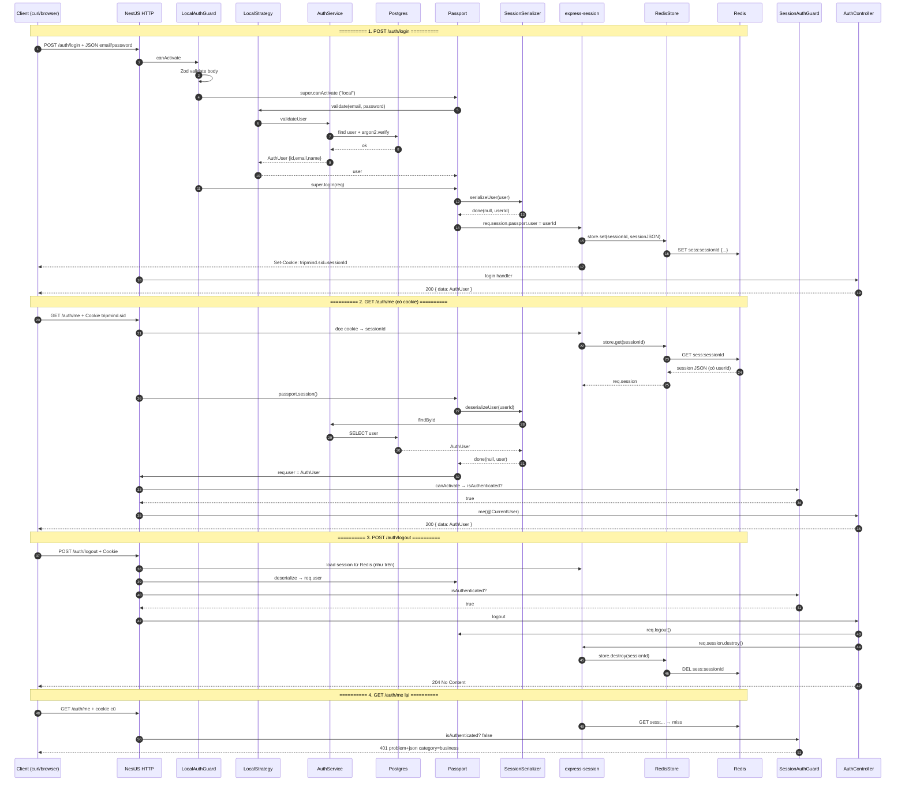

# Auth session — Full luồng Login → Me → Logout

> Tài liệu học: đọc kèm code trong `apps/api/src/auth/` và `bootstrap/configure-app.ts`, `main.ts`.  
> Cập nhật: 2026-07-15.

---

## Sequence đầy đủ (các layer)



> Tip: trong VS Code/Cursor, cài extension Mermaid hoặc preview Markdown để xem diagram.

---

## Các layer làm gì

| Layer | Vai trò trong flow |
|---|---|
| **Client** | Gửi body login; giữ/gửi cookie `tripmind.sid` |
| **LocalAuthGuard** | Cổng login: Zod → Strategy → `logIn` |
| **LocalStrategy** | Chứng minh email/password (`validate` — tên cứng) |
| **AuthService + Postgres** | Hash verify / load user |
| **SessionSerializer** | Login: user → `userId`; Me: `userId` → user (`done` callback) |
| **Passport** | Ghép Strategy + Serializer + `req.user` / `isAuthenticated` |
| **express-session** | Quản lý `req.session`; set/read cookie |
| **RedisStore (`connect-redis`)** | Bridge: session ↔ lệnh Redis |
| **Redis** | Lưu `sess:<id>` = JSON session (có `passport.user` = userId) |
| **SessionAuthGuard** | Me/Logout: chỉ hỏi đã login chưa (không gọi Strategy) |
| **Controller** | Trả `{ data }` / 204; logout gọi destroy |

---

## Dữ liệu lúc đang login

```
Cookie (client)              Redis
tripmind.sid = abc123   →    key:   sess:abc123
                             value: {
                               cookie: { ... },
                               passport: { user: "<userId>" }
                             }
```

- **Serializer** quyết định `passport.user` là **id** (`done(null, user.id)`).
- **RedisStore + express-session** lo **cất / lấy / xóa** key đó.
- Serializer **không** gọi Redis trực tiếp.

---

## Nhớ nhanh 2 bước login

| Gọi | Ý nghĩa |
|---|---|
| `super.canActivate()` | Chạy Strategy → password đúng không? |
| `super.logIn()` | Chạy `serializeUser` → ghi session → Redis + cookie |

---

## File map

| Bước | File |
|---|---|
| RedisStore gắn vào session | `apps/api/src/main.ts` |
| `session()` + `passport.session()` | `apps/api/src/bootstrap/configure-app.ts` |
| Guard login | `apps/api/src/auth/guards/local-auth.guard.ts` |
| Strategy | `apps/api/src/auth/strategies/local.strategy.ts` |
| serialize / deserialize | `apps/api/src/auth/serializers/session.serializer.ts` |
| Guard me/logout | `apps/api/src/auth/guards/session-auth.guard.ts` |
| HTTP handlers | `apps/api/src/auth/auth.controller.ts` |
| `@CurrentUser()` | `apps/api/src/common/decorators/current-user.decorator.ts` |

---

## Tự thử

```bash
pnpm --filter @tripmind/api dev

curl -c cookies.txt -X POST http://localhost:3000/auth/login \
  -H "Content-Type: application/json" \
  -d '{"email":"demo@tripmind.local","password":"password123"}'

curl -b cookies.txt http://localhost:3000/auth/me
curl -b cookies.txt -X POST http://localhost:3000/auth/logout
curl -b cookies.txt http://localhost:3000/auth/me   # kỳ vọng 401
```

Có thể mở Redis Insight / `redis-cli KEYS 'sess:*'` để thấy key xuất hiện sau login và biến mất sau logout.
