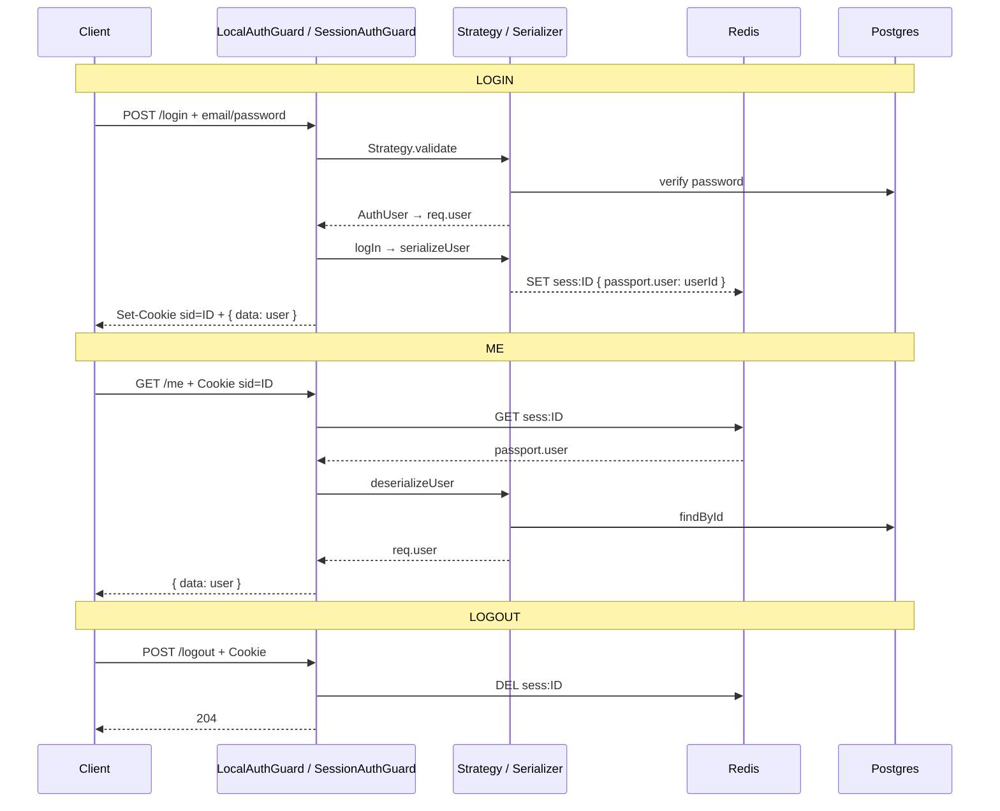

# Auth session — Tài liệu học (gọn, đủ)

> **Đọc file này là đủ** cho flow Login → Me → Logout.  
> Code: `apps/api/src/auth/`, `bootstrap/configure-app.ts`, `main.ts`.

---

## 1. Bức tranh 30 giây

```
LOGIN:  password đúng → nhớ userId trên Redis → đưa client một cookie (sessionId)
ME:     client gửi cookie → Redis lấy userId → Postgres lấy hồ sơ → req.user → trả JSON
LOGOUT: xóa Redis → cookie vô dụng
```

| Khái niệm | Ví dụ | Vai trò |
|---|---|---|
| **sessionId** | `NZB6-guCbEg...` | Chìa random trên cookie |
| **userId** | `87c3efab-...` | Id trong bảng `users` (Postgres) |
| **Cookie** | `tripmind.sid=NZB6-...` | Client gửi lại mỗi request |
| **Redis** | key `sess:NZB6-...` | Nhớ phiên (stateful) |
| **`req.user`** | `{ id, email, name }` | Hồ sơ đủ trên **1 request** |

**Đừng lẫn:** sessionId ≠ userId.

---

## 1b. Dòng thời gian (đọc từ trên xuống)

### T0 — App start (một lần)

1. `main.ts` tạo RedisStore  
2. `configure-app` gắn `express-session` + `passport.session()`  
→ Chỉ lắp ống, chưa có user nào login  

---

### T1 — User gửi Login

```
Client → POST /auth/login  { email, password }
```

| # | Thời điểm | Việc |
|---|---|---|
| 1 | Request vào | Nest tạo `req`, body = email/password |
| 2 | LocalAuthGuard | Zod check body |
| 3 | LocalStrategy.validate | Postgres + argon2 |
| 4 | Passport | Gắn **`req.user`** = `{ id, email, name }` |
| 5 | logIn → serializeUser | `req.session.passport.user` = **userId** (string) |
| 6 | express-session | Redis **SET** `sess:<sessionId>` = JSON session |
| 7 | Response | **`Set-Cookie: tripmind.sid=<sessionId>`** + `{ data: user }` |
| 8 | Client | Lưu cookie |

**Xong T1:** client có cookie; Redis có key; Postgres không đổi session.

---

### T2 — User gửi Me (sau đó, request mới)

```
Client → GET /auth/me   Cookie: tripmind.sid=<sessionId>
```

| # | Thời điểm | Việc |
|---|---|---|
| 1 | Request mới | `req` mới (trống user) |
| 2 | express-session | Đọc cookie → `req.sessionID` → Redis **GET** → `req.session` |
| 3 | passport.session | Đọc `passport.user` (userId) |
| 4 | deserializeUser | Postgres findById → gắn **`req.user`** |
| 5 | SessionAuthGuard | `isAuthenticated()`? |
| 6 | @CurrentUser | Đọc `req.user` |
| 7 | Response | `{ data: user }` (thường không Set-Cookie lại) |

**Xong T2:** không hỏi password; `req.user` build lại từ DB mỗi lần.

---

### T3 — User Logout

```
Client → POST /auth/logout   Cookie: tripmind.sid=<sessionId>
```

| # | Thời điểm | Việc |
|---|---|---|
| 1 | Load session | Như T2 (cookie → Redis → deserialize) |
| 2 | SessionAuthGuard | Phải đang login |
| 3 | logout + destroy | Redis **DEL** `sess:<sessionId>` |
| 4 | Response | `204` |

---

### T4 — Me lại (cookie cũ còn trên máy)

```
GET /auth/me + cookie cũ → Redis miss → 401
```

---

### Timeline một dòng

```
T0 lắp ống
 → T1 login: Strategy→req.user → serialize→Redis → Set-Cookie
 → T2 me:    Cookie→Redis→deserialize→req.user → JSON
 → T3 logout: DEL Redis
 → T4 me:    401
```

---

## 2. Trên `req` có gì? (trung tâm để hiểu)

Mỗi HTTP request = một object `req` (sống hết request rồi bỏ).

```
req
├── body              ← JSON login (email, password)
├── sessionID         ← = cookie = phần sau "sess:" trên Redis
├── session           ← nội dung load từ Redis VALUE
│   └── passport.user ← chỉ userId (string)
├── user              ← AuthUser object (Passport gắn)
├── isAuthenticated() / logIn() / logout()
```

| Field | Kiểu | Ai gắn |
|---|---|---|
| `req.sessionID` | string sessionId | express-session (từ cookie) |
| `req.session` | object ≈ Redis VALUE | express-session |
| `req.session.passport.user` | string userId | Passport sau **serialize** |
| `req.user` | `{ id, email, name }` | Passport: **Strategy** (lúc login) hoặc **deserialize** (lúc /me) |

`@CurrentUser()` **chỉ đọc** `req.user` — không tự deserialize.

---

## 3. Redis lưu gì?

```
KEY:   sess:<sessionId>          ← prefix + req.sessionID
VALUE: {
  "cookie": { originalMaxAge, httpOnly, sameSite, path, ... },
  "passport": { "user": "<userId>" }
}
TTL:   ~7 ngày (604800 giây) theo config cookie
```

| | Redis | `req` |
|---|---|---|
| Key (bỏ `sess:`) | sessionId | `req.sessionID` |
| Value | JSON trên | ≈ `req.session` |

- **RedisStore** = adapter (express-session ↔ lệnh Redis), không phải kho thứ 2.  
- Postgres **không** lưu sessionId; chỉ lưu user / trip…

---

## 4. Flow Login (`POST /auth/login`)

### Client gửi

```http
POST /auth/login
Content-Type: application/json

{"email":"demo@tripmind.local","password":"password123"}
```

### Server (thứ tự)

1. **LocalAuthGuard** — Zod validate body  
2. **`super.canActivate()`** → **LocalStrategy.validate** → DB + argon2  
3. Passport gắn **`req.user`** = object Strategy trả về  
4. **`super.logIn()`** → **serializeUser** → `done(null, userId)`  
5. Ghi `req.session.passport.user = userId`  
6. express-session + RedisStore → **SET** `sess:<sessionId>`  
7. Response **`Set-Cookie: tripmind.sid=<sessionId>; HttpOnly; SameSite=Lax; Max-Age=604800`**  
8. Controller `@CurrentUser()` đọc `req.user` → `{ data: user }`

### Trên login, `@CurrentUser` lấy từ đâu?

Từ **`req.user` vừa gắn bởi Strategy** (cùng request) — **không** từ Redis/deserialize.

---

## 5. Flow Me (`GET /auth/me`)

### Client gửi

```http
GET /auth/me
Cookie: tripmind.sid=<sessionId>
```

Không gửi password.

### Server (thứ tự)

1. express-session: cookie → `req.sessionID` → Redis **GET** → `req.session`  
2. `passport.session()`: đọc `passport.user` (userId)  
3. **deserializeUser(userId)** → `findById` Postgres → gắn **`req.user`**  
4. **SessionAuthGuard** — `isAuthenticated()`?  
5. `@CurrentUser()` → trả `{ data: req.user }`

```
Redis passport.user (string id)
    → deserialize + Postgres
    → req.user (object đủ)
```

Có `passport.user` trong Redis **không** tự thành `req.user` — phải deserialize.

---

## 6. Flow Logout (`POST /auth/logout`)

1. Cookie → load session (như Me)  
2. SessionAuthGuard  
3. `req.logout()` + `req.session.destroy()` → Redis **DEL**  
4. `204` — cookie trên máy client có thể còn nhưng key Redis mất → Me sau = 401  

---

## 7. Sequence (Mermaid)



---

## 8. Guard vs Strategy vs Serializer

| Thành phần | Việc |
|---|---|
| **LocalAuthGuard** | Cổng login: Zod → Strategy → `logIn` |
| **LocalStrategy** | `validate(email,password)` — tên hàm **cứng** |
| **SessionSerializer** | serialize: user→userId; deserialize: userId→user |
| **SessionAuthGuard** | Chỉ `isAuthenticated()` — không hỏi password |

`canActivate` = Nest Guard (tên cứng).  
`done(err, data)` = callback Passport báo kết quả serialize/deserialize.

---

## 9. Nhiều user / nhiều thiết bị / 2 tab

| Tình huống | Session |
|---|---|
| 2 user khác máy | 2 cookie, 2 key Redis |
| 1 user 2 điện thoại | 2 session (cùng userId, khác sessionId) |
| 1 user 2 tab **cùng browser** | **Chung 1 cookie** → chung 1 session; logout 1 tab = mất cả |

Force logout **mọi thiết bị**: chưa có (Redis không index theo userId). Logout 1 máy = `DEL` đúng key đó → được.

---

## 10. File cần mở (theo thứ tự)

| # | File |
|---|---|
| 1 | `main.ts` — RedisStore |
| 2 | `bootstrap/configure-app.ts` — `session()` + `passport.session()` |
| 3 | `auth/guards/local-auth.guard.ts` |
| 4 | `auth/strategies/local.strategy.ts` |
| 5 | `auth/serializers/session.serializer.ts` |
| 6 | `auth/guards/session-auth.guard.ts` |
| 7 | `auth/auth.controller.ts` |
| 8 | `common/decorators/current-user.decorator.ts` |

---

## 11. Tự thử

```bash
pnpm --filter @tripmind/api dev

curl -c cookies.txt -X POST http://localhost:3000/auth/login \
  -H "Content-Type: application/json" \
  -d '{"email":"demo@tripmind.local","password":"password123"}'

curl -b cookies.txt http://localhost:3000/auth/me
curl -b cookies.txt -X POST http://localhost:3000/auth/logout
curl -b cookies.txt http://localhost:3000/auth/me   # 401

docker compose -f infra/docker-compose.yml exec redis redis-cli KEYS 'sess:*'
```

---

## Checklist “đã hiểu”

- [ ] Cookie chỉ mang **sessionId**, không mang password  
- [ ] Redis VALUE ≈ `req.session`; key ≈ `sess:` + `req.sessionID`  
- [ ] `passport.user` = userId string; `req.user` = object từ Strategy (login) hoặc deserialize (/me)  
- [ ] `@CurrentUser` chỉ đọc `req.user`  
- [ ] Login: Strategy → `req.user` rồi mới serialize lên Redis  
